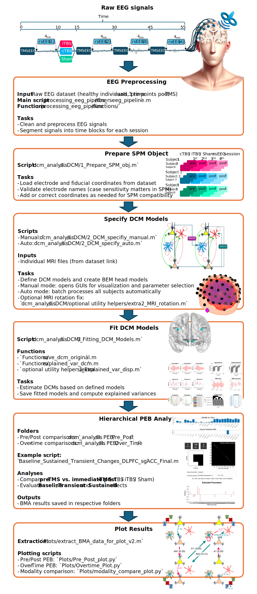

# Hierarchical neurobiological changes in DLPFC–sgACC connectivity induced by Theta-Burst Stimulation
This repository contains code that can be used to reproduce a Dynamic Causal Modelling (DCM) analysis and hierarchical Parametric Empirical Bayes (PEB) analysis for computing induced connectivity changes in DLPFC–sgACC brain regions after Theta Burst Stimulation (TMS) in 22 healthy participants.

## Requirements
- MATLAB (R2023b)
- SPM 25 (25.01.rc3)
- Python 3
- FieldTrip (20231220)

## Data
Available: https://doi.org/10.25452/figshare.plus.c.5910329

Citation: Moffa, A. H. et al. Neuromodulatory effects of theta burst stimulation to the prefrontal cortex. Sci Data 9, 717 (2022).

-->
## Step by Step Guide

<!--
### 1️⃣ Preprocessing

**Input:** Raw EEG dataset (healthy individuals, pre- and 3 time-points post-TMS)  
**Main script:** `processing_eeg_pipeline/tbs_rseeg_pipeline.m`  
**Functions:** `processing_eeg_pipeline/functions/`

**Tasks**
- Clean and preprocess EEG signals  
- Segment signals into time blocks for each session

---

### 2️⃣ Prepare SPM Object

**Script:** `dcm_analysis/I. DCM/1_Prepare_SPM_obj.m`

**Tasks**
- Load electrode and fiducial coordinates from dataset  
- Validate electrode names (case sensitivity matters in SPM)  
- Add or correct coordinates as needed for SPM compatibility

---

### 3️⃣ Specify DCM Models

**Scripts**
- Manual: `dcm_analysis/I. DCM/2_DCM_specifiy_manual.m`  
- Auto: `dcm_analysis/I. DCM/2_DCM_specify_auto.m`

**Inputs**
- Individual MRI files (from dataset link)

**Tasks**
- Define DCM models and create BEM head models  
- Manual mode: opens GUIs for visualization and parameter selection  
- Auto mode: batch processes all subjects automatically  
- Optional MRI rotation fix:  
  `dcm_analysis/I. DCM/optional utility helpers/extra2_MRI_rotation.m`

---

### 4️⃣ Fit DCM Models

**Script:** `dcm_analysis/I. DCM/3_Fitting_DCM_Models.m`

**Functions**
- `Functions/save_dcm_original.m`  
- `Functions/explained_var_dcm.m`  
- `optional utility helpers/extra1_Explained_var_disp.m`

**Tasks**
- Estimate DCMs based on defined models  
- Save fitted models and compute explained variances

---

### 5️⃣ Hierarchical PEB Analysis

**Folders**
- Pre/Post comparisons: `dcm_analysis/II. PEB/Pre_Post/`  
- Over-time comparisons: `dcm_analysis/II. PEB/Over_Time/`

**Example script:**  
`Baseline_Sustained_Transient_Changes_DLPFC_sgACC_Final.m`

**Analyses**
- Compare **pre-TMS vs. immediate post-TMS** (cTBS / iTBS / Sham)  
- Evaluate **Baseline**, **Transient**, and **Sustained** effects

**Outputs**
- BMA results saved in respective folders

---

### 6️⃣ Plot Results

**Extraction:** `Plots/extract_BMA_data_for_plot_v2.m`

**Plotting scripts**
- Pre/Post PEB: `Plots/Pre_Post_plot.py`  
- Over-Time PEB: `Plots/Overtime_Plot.py`  
- Modality comparison: `Plots/modality_compare_plot.py`

---
-->
<!--
### 📁 Summary Workflow

Raw EEG  

 ↓  

processing_eeg_pipeline/  

 ↓  
  

 dcm_analysis/I. DCM/   

 ↓  
  

dcm_analysis/II. PEB/   

 ↓  
     

Plots/   

-->
